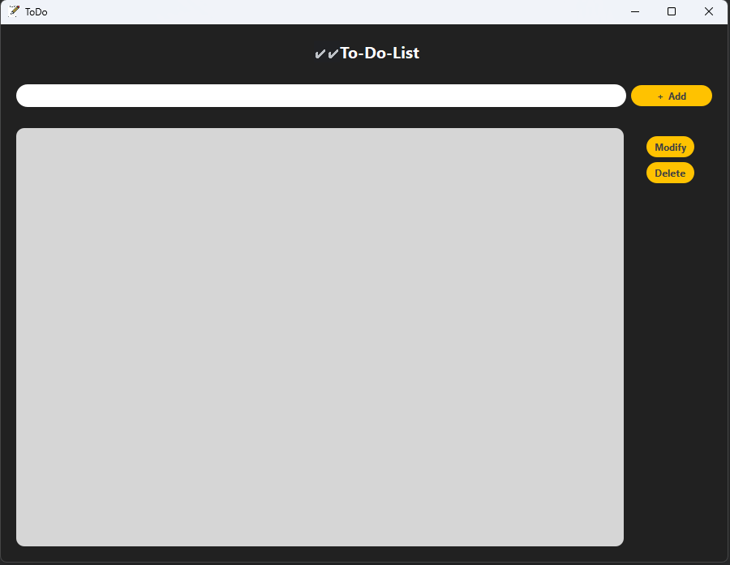
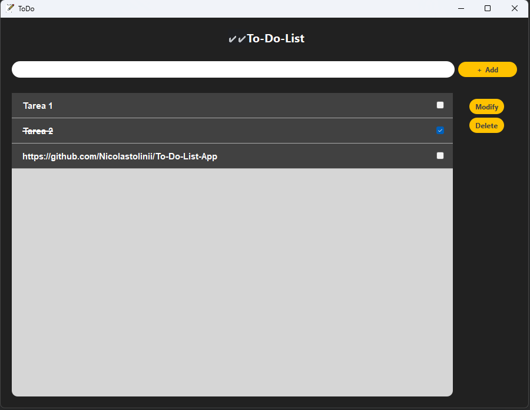
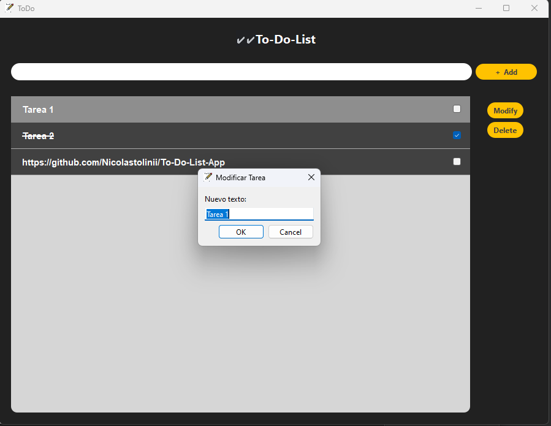

<h1 align="center">To-Do List App</h1>

<p align="center">
  
</p>

<h2 align="center">Descripción</h2>

<p align="center">
  Esta es una aplicación simple de lista de tareas creada con Qt y C++. Permite a los usuarios gestionar sus tareas diarias de manera efectiva.
</p>

<h2 align="center">Capturas de Pantalla</h2>

<p align="center">
  
  
</p>

<h2 align="center">Características</h2>

- Agregar nuevas tareas.
- Marcar tareas como completadas.
- Editar el texto de las tareas existentes.
- Eliminar tareas.

<h2 align="center">Instalación</h2>

1. Clona este repositorio:

   ```bash
   git clone https://github.com/Nicolastolinii/To-Do-List-App
   
    ```
2.Abrir QT Creator y abrir el proyecto en el directorio clonado.

3.Hacer Build:Release, se les va a compilar el .exe en el directorio del proyecto.

4.Crear una nueva carpeta, arrastrar el .exe generado a la misma.

5.Abrir Terminal QT MinGW, en el Path de la carpeta recien generada

6. ejecutar comando:
```bash
windeployqt.exe .
```

# Diviértete organizando tus tareas diarias! 📝✨
